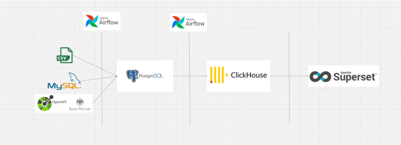
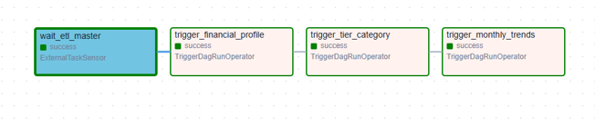

# DWH

# ETL-проект: Имитация DWH с оркестрацией в Airflow

**Цель:** реализация сквозного пайплайна обработки и визуализации данных — от генерации данных в разных источниках до построения дашбордов в Superset. Все процессы автоматизированы и выполняются ежедневно с помощью Apache Airflow.

## 📦 Используемые технологии

- **Docker**, **Git**
- **Apache Airflow** — оркестрация пайплайнов
- **PostgreSQL**, **MySQL**, **ClickHouse** — хранилища и витрины данных
- **Apache Superset** — визуализация и дашборды
- **Open API ЦБ РФ** — внешние данные о валютных курсах
- **pandas** — обработка данных в Python

---

## 🔁 Логика пайплайна

### 1. Генерация данных

- `transactions.csv` — псевдотранзакции
- MySQL:
  - пользователи
  - категории транзакций
- PostgreSQL:
  - валютные курсы с Open API Центробанка РФ

### 2. Перемещение и преобразование данных

- Перенос пользователей и транзакций в PostgreSQL
- Пересчет сумм транзакций в рубли (по курсу на дату)

### 3. Построение витрин в ClickHouse

- Финансовые профили пользователей
- Ежемесячные тренды трат
- Аггрегации по категориям

### 4. Дашборд в Superset

- Средние траты по валютам
- Баланс клиентов по уровням
- Средние траты по категориям
- Распределение клиентов по уровням

---

## 🧩 Архитектура



---

## 📊 DAG-структура Airflow




---

## 🚀 Запуск

> Требуется Docker и Docker Compose

```bash
# Клонировать репозиторий
git clone https://github.com/shmoki-molla/DWH.git
cd dwh


